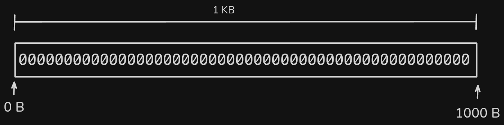

# Disks

Disks are simulated using binary files with `.dsk` extension where the various structures are stored to simulate the functionality of a file system and partitions it could contain.

The following figure graphically illustrates how the different structures are written to the disk to understand its operation and simulation.

The creation and details of the disk will be specified later in the respective commands, but it is clarified that when creating a disk it is filled with binary zeros to represent that it is available space.

The file size does not change once it has been created and a defined storage location has been designated.