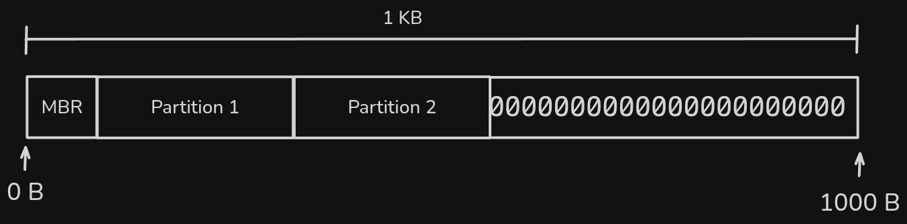
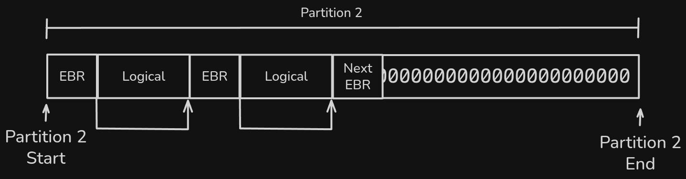

# Extended Boot Record (EBR)
The EBR is a descriptor of a logical unit, as it contains the unit's information and data and points to the location where the next EBR will be written. The EBR can be viewed as a type of linked list. It has the following values:

| Name         | Type       | Description                                                                                       |
| ------------ | ---------- | ------------------------------------------------------------------------------------------------- |
| `part_mount` | `char`     | Indicates whether the partition is mounted or not.                                                |
| `part_fit`   | `char`     | Partition allocation strategy. Possible values are **B** (Best), **F** (First), or **W** (Worst). |
| `part_start` | `int`      | Indicates the byte offset on the disk where the partition starts.                                 |
| `part_s`     | `int`      | Contains the total size of the partition in bytes.                                                |
| `part_next`  | `int`      | Byte offset where the next EBR is located. `-1` if there is no next EBR.                          |
| `part_name`  | `char[16]` | Name of the partition.                                                                            |

In this case, it is taken into account that partition 2 is an extended partition, and, similarly to the previous case, space is reserved for writing to the logical drives with their respective EBRs.

