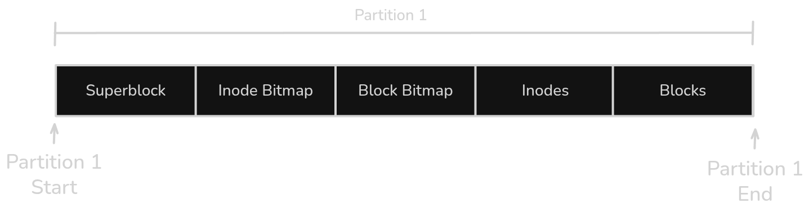
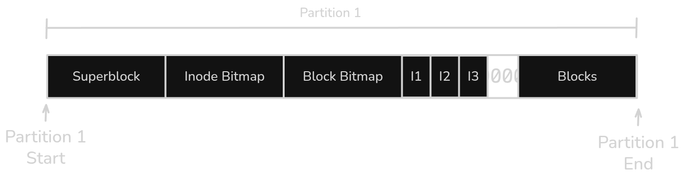

# EXT2/EXT3 File System

## EXT2
For the EXT2 file system, the structures described below are implemented. The block layout is as follows:

The number of data blocks is three times the number of inodes. To determine how many inodes and blocks can fit within a partition, solve the following equation for **n** and take the floor of the result. The value of **n** represents the number of inodes, while the number of blocks is **3 × n**.

$$\text{partition\_size} = \text{sizeof}(\text{superblock})
                + n
                + 3n
                + n \cdot \text{sizeof}(\text{inode})
                + 3n \cdot \text{sizeof}(\text{block})
$$

$$number\_of\_structures = \lfloor n \rfloor$$

## EXT3

For the EXT3 file system, the structures described below are implemented. The block layout is as follows:

The number of blocks is three times the number of inodes. The number of journaling entries, inodes, and blocks that can be created within the partition is determined by solving the following equation for **n** and taking the floor of the result. The value **n** represents both the number of journaling entries and the number of inodes, while the number of blocks is **3 × n**.

$$\text{partition\_size} = \text{sizeof}(\text{superblock})
               + n
               + n \cdot \text{sizeof}(\text{Journaling})
               + 3 \cdot n
               + n \cdot \text{sizeof}(\text{inode})
               + 3 \cdot n \cdot \text{sizeof}(\text{block})
$$

$$\text{number\_of\_structures} = \text{floor}(n)$$

In this case, the block structure of the EXT2 file system is used. For the purposes of this example, it is assumed that this file system has been assigned to Partition 1. Note that the Inodes and Blocks sections represent only reserved storage areas. Multiple contiguous inode and block structures will be stored within these regions as needed, as illustrated in the following figure.

The figure illustrates how multiple inode structures were stored within the inode-reserved space. The details of these structures are discussed in the following sections.