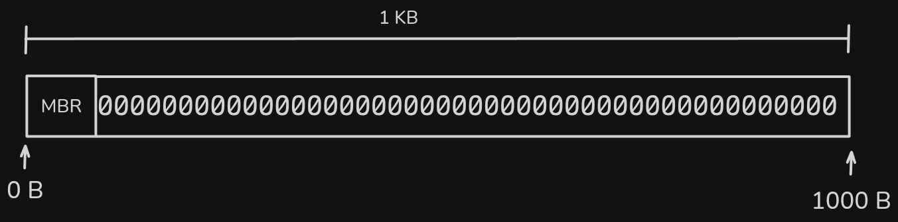

# Master Boot Record (MBR)

When a new disk is created, it contains an MBR, as it provides information about the file system and partitions; this is located in the first sector of the disk. It has the following values:

| Name                  | Type          | Description |
|-----------------------|---------------|-------------|
| mbr_size              | int           | Disk's total size in bytes |
| mbr_creation_date     | time          | Date and time of creation of the disk |
| mbr_signature         | int           | Random number which uniquely identifies each disk |
| dsk_fit               | char          | Partition adjustment type. It will have the following values: **B** (Best), **F** (First), or **W** (Worst). |
| mbr_partitions        | partition[4]  | Structure with information from the 4 partitions |

