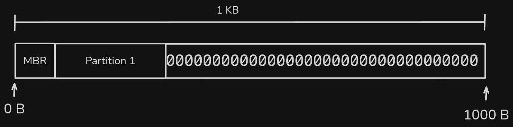

# Partition

A partition is a logical division of a disk that file systems treat as a separate drive. It has the following values:

| Name              | Type     | Descripción                                                                                        |
|-------------------|----------|----------------------------------------------------------------------------------------------------|
| part_status       | char     | Indicates whether the partition is mounted or not.                                                 |
| part_type         | char     | Indicates the partition type, primary or extended. It will have the values ​​**P** or **E**.         |
| part_fit          | char     | Partition adjustment type. It will have the values ​​**B** (Best), **F** (First) or **W** (Worst).   |
| part_start        | int      | Indicate which byte of the disk the partition starts on.                                           |
| part_s            | int      | It contains the total size of the partition in bytes.                                              |
| part_name         | char[16] | Partition name.                                                                                    |
| part_correlative  | int      | Indicate the partition number.                                                                     |
| part_id           | char[4]  | Indicates the ID of the partition generated when mounting this partition; this is explained later. |

- **Primary Partitions:** A primary partition can be used to boot an operating system and contain various files not directly related to the operating system.
- **Extended Partitions:** An extended partition is used to contain logical drives. These partitions are managed by an EBR (Extended Boot Record). Creating this partition creates the first EBR.
- **Logical Drives:** These drives contain files not related to the operating system, such as data, audio, video, and others. These logical drives are managed by an EBR.

When writing a primary partition, that space is reserved to write other structures within that space to simulate the partition's operation. It is clarified that the partition object is only updated in the MBR.